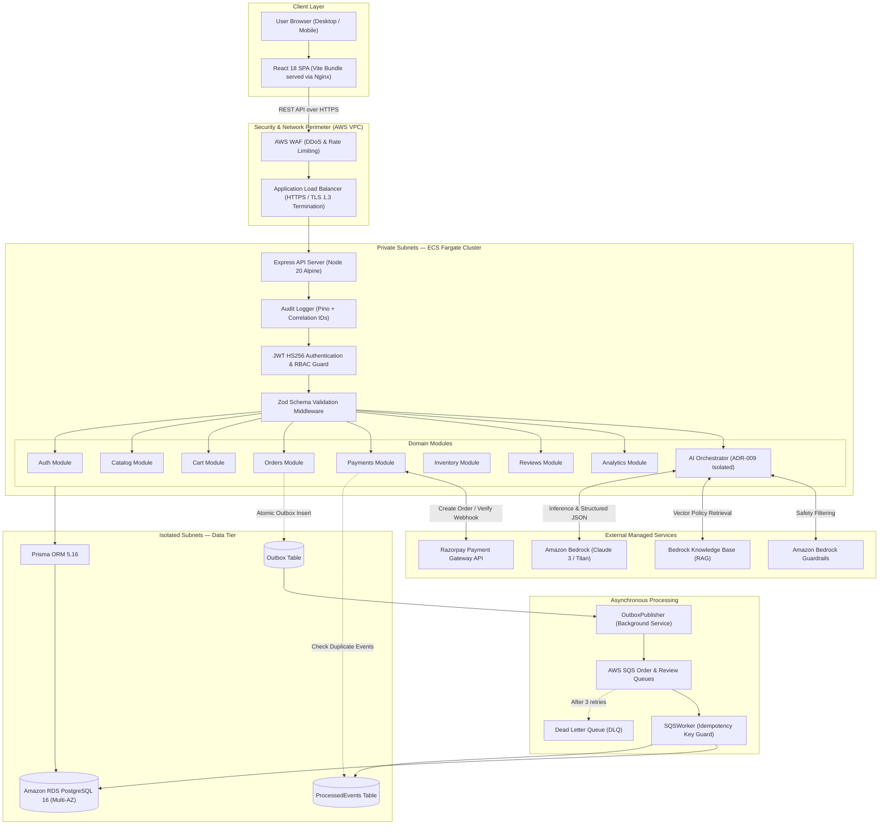

# MarketMind AI — Actual Architecture & System Design

## 1. Architectural Classification

**MarketMind AI is a Modular Monolith with an Asynchronous Transactional Outbox Event Pipeline.**

### Why It Is a Modular Monolith
1. **Single Deployment Unit**: The application runs as a unified Node.js/Express process deployed on Amazon ECS Fargate.
2. **Domain Isolation**: Boundaries between business domains (`auth`, `catalog`, `orders`, `payments`, `inventory`, `analytics`, `ai`) are strictly maintained via distinct directory modules, internal service interfaces, and Zod schemas.
3. **Local ACID Guarantees**: Inter-module transactions (such as checking stock, reserving inventory, creating an order, and creating an outbox event) execute inside a single PostgreSQL interactive database transaction (`prisma.$transaction`). This avoids distributed transactions (Two-Phase Commit / Sagas) while retaining clean modular boundaries.

### Why It Is Event-Driven & Asynchronous
1. **Transactional Outbox Pattern**: High-latency external network operations (dispatching messages to AWS SQS, sending notifications, running sentiment analysis) are not performed in the client's synchronous HTTP request path.
2. **Decoupled Consumers**: State changes write to an `Outbox` table. A background poller (`OutboxPublisher`) publishes them to AWS SQS, and an idempotent consumer (`SQSWorker`) processes them asynchronously.

---

## 2. End-to-End Architecture Diagram

---

## 3. Component Deep Dive: Inputs, Outputs & Failure Modes

### 3.1 Application Load Balancer (ALB)
- **Responsibility**: Ingress controller, TLS 1.3 termination, automatic HTTP→HTTPS redirect (port 80 to 443), health check probing on `/health`.
- **Technology**: AWS Application Load Balancer.
- **Input**: Public internet HTTPS traffic.
- **Output**: Forwarded plain HTTP traffic to private ECS Fargate tasks on port 4000.
- **Failure Scenario**: Target group healthy threshold failure (502 Bad Gateway). Resolved via ECS deployment circuit breakers and automatic rollback.

### 3.2 Express Gateway & Middleware Pipeline
- **Responsibility**: Security header injection (Helmet), CORS verification, sliding-window rate limiting, structured audit logging, JWT payload decoding, and Zod input validation.
- **Technology**: Express 4.19, Helmet, Pino, Zod, JsonWebToken.
- **Input**: Raw HTTP request headers, cookies, query parameters, JSON body.
- **Output**: Strongly typed `req.user` context and parsed `req.body`, or `400 VALIDATION_ERROR` / `401 UNAUTHORIZED`.

### 3.3 Core Commerce Modules (`orders`, `inventory`, `payments`)
- **Responsibility**: Enforce ACID database transactions, pessimistic row locking during stock reservation, paise currency precision, and timing-safe HMAC SHA256 payment verification.
- **Technology**: Prisma ORM, Node.js `crypto` module, Razorpay SDK.
- **Input**: Customer ID, items array, payment callbacks, Razorpay webhook signatures.
- **Output**: Committed orders with `status: PENDING` or `PAID`, updated stock counters, outbox event records.
- **Failure Scenario**: Overselling attempt during flash sales. Handled deterministically by checking `availableQuantity = quantity - reservedQuantity >= requestedQuantity` and throwing `INSUFFICIENT_STOCK` (400) without data corruption.

### 3.4 GenAI Module (`ai`)
- **Responsibility**: Seller Copilot listing generation, Amazon Bedrock RAG support chat, deterministic hybrid recommendations, moving-average demand forecasting, and anomaly investigation.
- **Technology**: `@aws-sdk/client-bedrock-runtime`, Anthropic Claude 3 models.
- **Governance**: **ADR-009 State Isolation**. AI models NEVER directly write to database tables without human approval or strict Zod regex allowlists.
- **Failure Scenario**: Bedrock API throttling or service unavailability. Handled via graceful fallback handlers returning deterministic offline advice and canned support templates.
