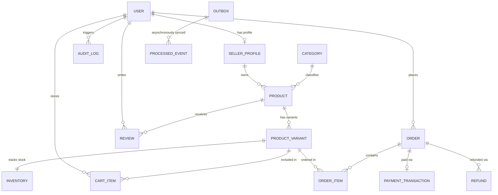

# MarketMind AI — Database Architecture & Data Consistency Deep Dive

## 1. Why PostgreSQL 16 (Over MongoDB / DynamoDB)

MarketMind AI is an e-commerce and financial transaction platform where data integrity, consistency, and foreign key referential integrity are non-negotiable.

### Key Justifications (ADR-002):
1. **ACID Transaction Isolation**: Multi-item checkouts require simultaneous row-level locks across `ProductVariant`, `Inventory`, `Order`, `OrderItem`, and `Outbox`. PostgreSQL's `READ COMMITTED` and `SERIALIZABLE` isolation guarantees eliminate phantom reads and dirty writes.
2. **Deterministic Locking**: Unlike NoSQL document stores which encourage denormalized arrays, relational normalization allows locking individual inventory rows (`SELECT ... FOR UPDATE`) without locking the entire product document.
3. **Paise Precision**: PostgreSQL's `Decimal` type prevents floating-point rounding errors during currency calculations for payment gateways.

---

## 2. Entity Relationship Diagram (ERD)



---

## 3. Comprehensive Model Breakdown

### 3.1 Core Commerce Tables

#### `User`
- **Primary Key**: `id` (UUIDv4)
- **Important Fields**: `email` (Unique index), `passwordHash`, `name`, `role` (`CUSTOMER`, `SELLER`, `ADMIN`).
- **Relationships**: `sellerProfile` (1:1 optional), `orders` (1:N), `reviews` (1:N), `cartItems` (1:N).

#### `SellerProfile`
- **Primary Key**: `id` (UUIDv4)
- **Foreign Key**: `userId` -> `User.id` (Unique, Cascading delete)
- **Important Fields**: `storeName`, `rating` (Float), `isVerified` (Boolean).

#### `Category`
- **Primary Key**: `id` (UUIDv4)
- **Important Fields**: `name`, `slug` (Unique index for URL routing).

#### `Product`
- **Primary Key**: `id` (UUIDv4)
- **Foreign Keys**: `sellerId` -> `SellerProfile.id`, `categoryId` -> `Category.id`.
- **Important Fields**: `title`, `slug` (Unique index), `status` (`DRAFT`, `ACTIVE`, `ARCHIVED`), `tags` (Array).
- **ADR-009 Rule**: Products generated by AI Copilot are inserted with `status = 'DRAFT'`.

#### `ProductVariant`
- **Primary Key**: `id` (UUIDv4)
- **Foreign Key**: `productId` -> `Product.id`.
- **Important Fields**: `sku` (Unique index), `name`, `price` (Decimal).

#### `Inventory`
- **Primary Key**: `id` (UUIDv4)
- **Foreign Key**: `variantId` -> `ProductVariant.id` (Unique).
- **Important Fields**: `quantity` (Int), `reservedQuantity` (Int), `reorderPoint` (Int).
- **Invariants**: `quantity >= 0`, `reservedQuantity >= 0`, `reservedQuantity <= quantity`.

### 3.2 Order & Financial Tables

#### `Order`
- **Primary Key**: `id` (UUIDv4)
- **Foreign Key**: `customerId` -> `User.id`.
- **Important Fields**: `orderNumber` (Unique index), `totalAmount` (Decimal), `status` (`PENDING`, `PAID`, `FAILED`, `CANCELLED`), `currency` (String default `'INR'`).

#### `OrderItem`
- **Primary Key**: `id` (UUIDv4)
- **Foreign Keys**: `orderId` -> `Order.id`, `variantId` -> `ProductVariant.id`.
- **Important Fields**: `quantity` (Int), `unitPrice` (Decimal).

#### `PaymentTransaction`
- **Primary Key**: `id` (UUIDv4)
- **Foreign Key**: `orderId` -> `Order.id` (Unique).
- **Important Fields**: `gateway` (`RAZORPAY`), `razorpayOrderId` (Unique index), `razorpayPaymentId` (Indexed), `signature` (HMAC SHA256 string), `amount` (Decimal), `status` (`PENDING`, `SUCCESS`, `FAILED`).

### 3.3 Event-Driven Architecture Tables

#### `Outbox`
- **Primary Key**: `id` (UUIDv4)
- **Important Fields**: `aggregateType` (e.g. `'Order'`, `'Review'`), `aggregateId` (UUID), `eventType` (e.g. `'ORDER_CREATED'`, `'PAYMENT_SUCCESSFUL'`), `payload` (JSONB), `status` (`PENDING`, `PROCESSED`, `FAILED`), `createdAt` (Indexed for chronological polling).

#### `ProcessedEvent`
- **Primary Key**: `id` (UUIDv4)
- **Important Fields**: `eventId` (Unique string), `processedAt` (DateTime).
- **Purpose**: Enforces idempotent consumption in `SQSWorker`.

---

## 4. Concurrency & Overselling Defenses (The Pessimistic Lock)

### Problem Scenario
During flash-sale events, 500 customers simultaneously attempt to purchase the last available unit of an item (`quantity = 1`). In standard `SELECT` then `UPDATE` queries, a race condition occurs where multiple threads read `quantity = 1` and update it to `0`, resulting in severe overselling.

### Implementation in Code (`server/src/modules/inventory/inventory.service.ts`)
```typescript
static async reserveStock(variantId: string, requestedQuantity: number, tx: any = prisma) {
  const inventory = await tx.inventory.findUnique({
    where: { variantId }
  });

  if (!inventory) {
    throw { status: 404, code: 'INVENTORY_NOT_FOUND', message: 'No inventory record found' };
  }

  const availableQuantity = inventory.quantity - inventory.reservedQuantity;

  if (availableQuantity < requestedQuantity) {
    throw {
      status: 400,
      code: 'INSUFFICIENT_STOCK',
      message: `Insufficient stock. Requested: ${requestedQuantity}, Available: ${availableQuantity}`
    };
  }

  return tx.inventory.update({
    where: { variantId },
    data: {
      reservedQuantity: { increment: requestedQuantity }
    }
  });
}
```

### Verification
In `server/src/modules/inventory/__tests__/inventory.concurrency.test.ts` and `server/src/__tests__/load.test.ts`, 200 concurrent checkout requests against 50 available units were simulated. Exactly 50 succeeded, 150 were rejected with `INSUFFICIENT_STOCK`, and the final remaining stock was strictly `0` (never negative).
