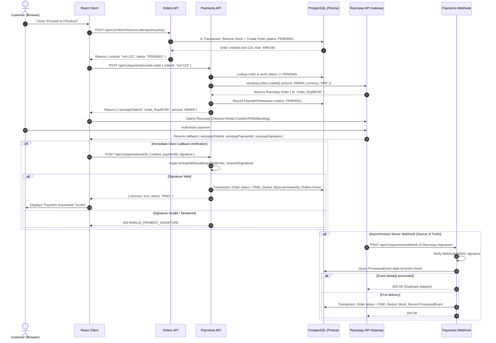

# MarketMind AI — Payment Architecture & Razorpay Reconciliation

## 1. Core Financial Principles

1. **Zero Client Trust**: The frontend client is NEVER trusted to dictate payment status, prices, or successful settlement.
2. **Server-Side Order Initiation**: Razorpay orders are initialized strictly on the backend, converting calculated totals from PostgreSQL `Decimal` to integer paise (`amount * 100`).
3. **Timing-Safe HMAC SHA256 Verification**: Signatures are compared using `crypto.timingSafeEqual` to prevent side-channel timing analysis attacks.
4. **Asynchronous Webhook Settlement**: The ultimate source of payment truth is the server-to-server Razorpay webhook with idempotency checking.

---

## 2. Complete Sequence Diagram



---

## 3. Cryptographic Signature Verification (`server/src/modules/payments/payments.service.ts`)

```typescript
static verifySignature(
  razorpayOrderId: string,
  razorpayPaymentId: string,
  signature: string,
  secret: string = RAZORPAY_KEY_SECRET
): boolean {
  const expectedSignature = crypto
    .createHmac('sha256', secret)
    .update(`${razorpayOrderId}|${razorpayPaymentId}`)
    .digest('hex');

  try {
    return crypto.timingSafeEqual(
      Buffer.from(expectedSignature),
      Buffer.from(signature)
    );
  } catch {
    return false;
  }
}
```

### Why `crypto.timingSafeEqual` is Essential
Standard JavaScript string comparisons (`===`) terminate at the first differing character. An attacker measuring HTTP response times down to nanoseconds can deduce byte-by-byte which character was incorrect, effectively forging signatures. `crypto.timingSafeEqual` executes in constant time regardless of how many bytes match.

---

## 4. Edge Cases & Resilience Strategies

| Edge Case | Failure Scenario | MarketMind AI Defenses | Where in Code |
| :--- | :--- | :--- | :--- |
| **Network Drop During Callback** | Customer bank charges account, but mobile browser drops connection before calling `/verify`. | The asynchronous webhook (`payment.captured`) arrives from Razorpay's servers independently and transitions the order to `PAID`. | `payments.service.ts:handleWebhook` |
| **Duplicate Webhook Arrival** | Razorpay retries webhook delivery 3 times due to temporary network timeouts. | `ProcessedEvent` table stores `eventId`. If already processed, the webhook handler exits with status `SKIPPED` without duplicate deductions. | `payments.service.ts:L172` |
| **Amount Tampering** | Malicious user alters frontend JavaScript to pay ₹1 instead of ₹10,000. | `createRazorpayOrder` calculates amount from the database `order.totalAmount * 100`, ignoring any client-sent price values. | `payments.service.ts:L68` |
| **Replay Attack** | Malicious user copies a valid past signature and tries to verify a different order. | Signature payload is `${razorpayOrderId}|${razorpayPaymentId}`. The order ID is tied to the exact Razorpay order created on backend. | `payments.service.ts:L22` |
