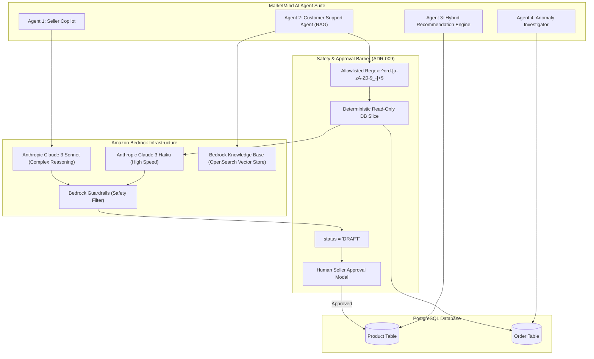

# MarketMind AI — GenAI Architecture, Bedrock RAG & Multi-Agent Systems

## 1. Architectural Philosophy: ADR-009 AI State Isolation

1. **Deterministic Core vs. Intelligent Advisor**:
   - The commerce engine (pricing, inventory deductions, order statuses, payment captures) is executed ONLY by deterministic application logic with ACID database constraints.
   - AI models act as advisors, summarizers, and content generators.
   - **AI NEVER directly mutates the database without human approval or strict Zod regex validation.**
2. **Bedrock Guardrails**:
   - Every prompt and output is scanned for PII leakage, prompt injection jailbreaks, and competitive defamation.

---

## 2. Multi-Agent Ecosystem Breakdown

---

## 3. The 4 Agents Deep Dive

### Agent 1: Seller Copilot
- **Purpose**: Generates high-converting product listings (title, markdown description, SEO keywords, suggested pricing band) from raw seller bullet points.
- **Model**: `anthropic.claude-3-sonnet-20240229-v1:0` via Amazon Bedrock.
- **Output Policy**: Strictly inserts into the database with `status = 'DRAFT'`.
- **Approval Flow**: The product CANNOT be purchased until the seller reviews the draft in the UI and clicks "Approve Listing".
- **Source Code**: `server/src/modules/ai/ai.service.ts`

### Agent 2: Customer Support Agent (Bedrock RAG + Tool Calling)
- **Purpose**: Answers customer inquiries regarding return policies, shipping times, and order statuses.
- **RAG Pipeline**:
  - Ingestion: Return policies, warranty terms, and shipping FAQs indexed in Amazon Bedrock Knowledge Bases (backed by OpenSearch Serverless).
  - Retrieval: Hybrid vector + keyword search retrieves top-k chunks.
- **Allowlisted Tool**: `lookupOrderStatus(orderId)`
  - Parameter Validation: Strictly enforced regex `^ord-[a-zA-Z0-9_-]+$`.
  - Security Boundary: Returns a sanitized read-only JSON slice (`{ id, status, trackingNumber }`). The LLM is never given direct SQL access or database connection handles.
- **Source Code**: `server/src/modules/ai/supportAgent.service.ts`

### Agent 3: Hybrid Recommendation Engine
- **Why Not Pure LLM**: Prompting an LLM to rank 10,000 products causes high latency (>2s), high token cost, and potential hallucinations of non-existent items.
- **Hybrid Pipeline**:
  1. *Deterministic SQL Candidate Retrieval*: Queries active products sharing category/tags with `stock > 0`.
  2. *Algorithmic Scoring*: `Score = 0.4 * Rating + 0.3 * Popularity + 0.3 * PriceAffinity`.
  3. *AI Personalization Rationale*: Attaches an explainable match reason ("Frequently bought with your wireless setup").
- **Source Code**: `server/src/modules/ai/recommendationEngine.service.ts`

### Agent 4: Anomaly Investigator & Forecaster
- **Forecasting**: Uses statistical moving averages across 30-day sales windows to compute safety stock and recommend exact reorder quantities `(reorderPoint * 2) - currentQuantity`.
- **Anomaly Detection**: Scans order logs for statistical spikes (e.g. refund rates exceeding 10.0%). Attaches an AI diagnostic root-cause summary.
- **Source Code**: `server/src/modules/ai/inventoryIntelligence.service.ts`, `anomalyInvestigator.service.ts`
