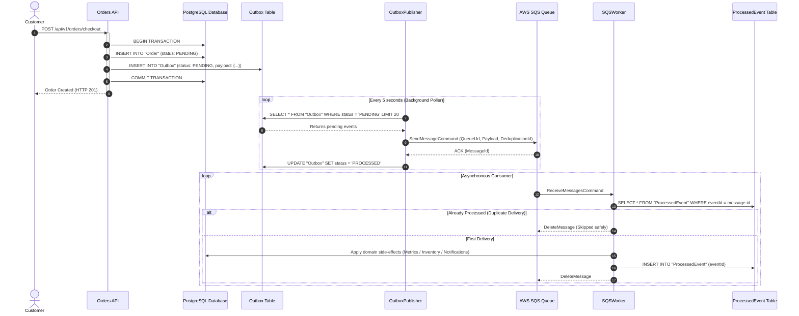

# MarketMind AI — Event-Driven Architecture & Transactional Outbox

## 1. Why the Transactional Outbox Pattern? (ADR-003)

### The Dual-Write Problem
When an order is created, the system must perform two actions:
1. Update the database (`INSERT INTO "Order"`).
2. Publish an event to the message broker (`sqs.sendMessage()`).

If the database commit succeeds but the network to SQS fails, the event is lost forever (inconsistent state). If the message is sent first but the database rollback triggers, downstream consumers process phantom orders.

### The Solution: Transactional Outbox
Both the `Order` record and the `Outbox` event record are committed inside a **single ACID database transaction**. If the transaction fails, neither is saved. If it succeeds, the event is guaranteed to exist.



---

## 2. Idempotent Consumer Implementation (`server/src/queue/sqsWorker.ts`)

```typescript
static async processEvent(message: SQSMessagePayload) {
  // 1. Idempotency Check
  const existing = await prisma.processedEvent.findUnique({
    where: { eventId: message.eventId }
  });

  if (existing) {
    return { status: 'SKIPPED', message: 'Event already processed' };
  }

  // 2. Atomic Side-Effects + Idempotency Commit
  await prisma.$transaction(async (tx) => {
    switch (message.eventType) {
      case 'ORDER_CREATED':
        await tx.auditLog.create({
          data: { actorId: message.payload.customerId, action: 'ORDER_CREATED_EVENT', details: message.payload }
        });
        break;
      case 'PAYMENT_SUCCESSFUL':
        await tx.auditLog.create({
          data: { actorId: message.payload.orderId, action: 'PAYMENT_SUCCESSFUL_EVENT', details: message.payload }
        });
        break;
    }

    // 3. Mark Event Processed
    await tx.processedEvent.create({
      data: { eventId: message.eventId }
    });
  });

  return { status: 'PROCESSED', eventId: message.eventId };
}
```

---

## 3. Dead-Letter Queue (DLQ) & Poison Pill Handling
In `infra/terraform/s3.tf`:
- `maxReceiveCount = 3`: If a message triggers unexpected runtime exceptions or unhandled schema mismatches 3 consecutive times, AWS SQS automatically routes the message to `marketmind-order-dlq.fifo`.
- This prevents "poison pill" messages from perpetually blocking the queue.
