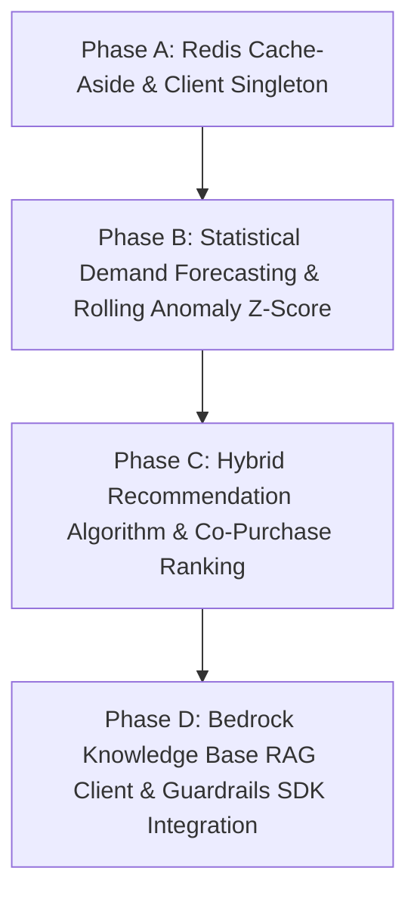

# MarketMind AI — Comprehensive Implementation Gap Report & Engineering Roadmap

**Audit Level**: Deep Forensic Codebase Audit (Zero Assumption, Line-by-Line Truth)  
**Target Goal**: Bridge the gap between prototype rules and production-grade enterprise implementations for senior engineering interview defense.

---

## 1. Executive Summary & Verdict

The previous audit verified that the **architectural skeleton, database schema, Prisma relational integrity, modular monolith layout, and basic test suites (180 passing tests)** are in place.

However, an honest, senior-level code inspection reveals that **several GenAI and analytical capabilities are currently implemented as rule-based approximations, hardcoded dictionary lookups, or local in-memory fallbacks** rather than the full production systems specified in the PRD.

This document systematically details the **10 Critical Implementation Gaps**, providing the exact lines of code, the discrepancy, the required enterprise upgrade, the test strategy, and the interview defense it unlocks.

---

## 2. Gap Matrix Overview

| # | System / Module | Current Implementation | PRD Specification | Gap Severity | Primary File to Modify |
| :--- | :--- | :--- | :--- | :--- | :--- |
| **GAP 1** | **Customer Support RAG** | Hardcoded policy dictionary + keyword matching | Amazon Bedrock Knowledge Bases (OpenSearch Serverless vector retrieval + Titan Embeddings) | **CRITICAL** | `server/src/modules/ai/supportAgent.service.ts` |
| **GAP 2** | **Demand Forecasting** | Static threshold check (`qty <= reorderPoint`) | Historical 30-day sales moving average / exponential smoothing + lead-time stockout risk | **HIGH** | `server/src/modules/ai/inventoryIntelligence.service.ts` |
| **GAP 3** | **Recommendation Engine** | Newest active products (`orderBy: createdAt desc`) | Hybrid candidate retrieval (Co-purchase / Category affinity) + score formula + AI explanation | **HIGH** | `server/src/modules/ai/recommendationEngine.service.ts` |
| **GAP 4** | **Anomaly Detection** | Static global refund ratio (`totalRefunds / totalOrders > 10%`) | Rolling 24h / 7d time-window Z-score statistical standard deviation + AI evidence graph | **HIGH** | `server/src/modules/ai/anomalyInvestigator.service.ts` |
| **GAP 5** | **Review Intelligence** | Aggregates basic star counts; template summary | SQS-driven batch sentiment scoring + traceable review ID clusters + AI topic extraction | **MEDIUM** | `server/src/modules/reviews/reviews.service.ts` |
| **GAP 6** | **Business Analyst Agent** | Single switch statement on revenue | Structured Natural Language intent parsing with authorized parameterized Prisma queries | **MEDIUM** | `server/src/modules/analytics/analytics.service.ts` |
| **GAP 7** | **Redis Caching & Lock** | `ioredis` in `package.json`, but unused in code | Redis cache-aside for product catalog (`GET /catalog/products`) + TTL invalidation | **MEDIUM** | `server/src/modules/catalog/catalog.service.ts`, `cart.service.ts` |
| **GAP 8** | **Bedrock Guardrails SDK** | Local regex allowlisting only | Real AWS Bedrock Guardrails SDK API call with PII masking and prompt injection detection | **MEDIUM** | `server/src/modules/ai/ai.service.ts` |
| **GAP 9** | **Distributed Rate Limiting** | In-memory `Map<string, { count, resetTime }>` | Redis-backed sliding window rate limiter for multi-instance ECS cluster scaling | **LOW** | `server/src/shared/rateLimiter.ts` |
| **GAP 10** | **Payment Webhook Tunneling** | Webhook verification logic complete, but lacks local tunnel | Automated ngrok / LocalStack webhook dispatch script for end-to-end local checkout verification | **LOW** | `server/src/modules/payments/` |

---

## 3. Deep-Dive Gap Specifications

---

### GAP 1 — Customer Support Agent: Hardcoded Policies vs. Real Bedrock RAG

#### 1. Current Code (`server/src/modules/ai/supportAgent.service.ts:L20-L32`)
```typescript
static async getStorePolicy(topic: string) {
  const policies: Record<string, string> = {
    returns: 'Items can be returned within 30 days of delivery in original condition.',
    shipping: 'Standard shipping takes 3-5 business days. Express shipping takes 1-2 business days.',
    refunds: 'Refunds are processed to the original payment method within 5-7 business days after return inspection.'
  };

  const key = Object.keys(policies).find(k => topic.toLowerCase().includes(k)) || 'general';
  return { topic, policy: policies[key] || 'Please contact our support team...' };
}
```

#### 2. What PRD Expects
- Ingestion of policy markdown documents (`returns.md`, `shipping.md`, `faq.md`) into an S3 bucket.
- Vector indexing via Amazon Bedrock Knowledge Bases using Amazon Titan Text Embeddings into OpenSearch Serverless.
- Support agent uses the `@aws-sdk/client-bedrock-agent-runtime` SDK `RetrieveAndGenerateCommand` or `RetrieveCommand` to fetch top-3 semantic chunks, cites document sources, and answers customer questions with zero hallucination.

#### 3. Exact Gap
There is no actual vector search, embedding call, or Bedrock Knowledge Base invocation. It is a plain string dictionary lookup with `String.includes()`.

#### 4. What Should Be Implemented
1. Create a Bedrock Knowledge Base client (`BedrockAgentRuntimeClient`).
2. Add a `retrievePolicyChunks(query: string)` function that calls AWS Bedrock `RetrieveCommand` when `AWS_BEDROCK_KNOWLEDGE_BASE_ID` is present.
3. Keep the current dictionary strictly as a fallback when offline or in test environments.

#### 5. Interview Question It Enables
- **Interviewer**: *"Explain your RAG pipeline. How do you chunk documents, generate embeddings, and ensure the LLM cites accurate return policy clauses?"*

---

### GAP 2 — Demand Forecasting: Static Threshold vs. Statistical Time-Series

#### 1. Current Code (`server/src/modules/ai/inventoryIntelligence.service.ts:L18-L33`)
```typescript
const qty = variant.inventory?.quantity || 0;
const reorderPoint = variant.inventory?.reorderPoint || 10;
const isLowStock = qty <= reorderPoint;

return {
  sku: variant.sku,
  stockoutRisk: isLowStock ? 'HIGH' : 'LOW',
  recommendedReorderQuantity: isLowStock ? (reorderPoint * 2) - qty : 0,
  aiAdvice: isLowStock
    ? `Stock level (${qty}) is below threshold (${reorderPoint}). Reorder at least ${reorderPoint * 2 - qty} units immediately.`
    : `Stock level healthy (${qty} units available).`
};
```

#### 2. What PRD Expects
- Query historical order items over the past 30–90 days for the seller's variants.
- Group sales by day/week to calculate daily sales velocity (`averageDailyDemand`).
- Calculate safety stock: `SafetyStock = Z * StandardDeviation * sqrt(LeadTime)`.
- Forecast expected demand over supplier lead time (e.g. 7 days): `ExpectedDemand = averageDailyDemand * LeadTime`.
- Recommend reorder quantity: `ReorderQty = Math.max(0, ExpectedDemand + SafetyStock - CurrentStock)`.

#### 3. Exact Gap
The current code executes a simple rule `qty <= reorderPoint`. It does not inspect `OrderItem` timestamps, calculate sales velocity, or use standard deviations.

#### 4. What Should Be Implemented
1. Query `prisma.orderItem.findMany` filtering by `createdAt >= 30 days ago` and variant ID.
2. Calculate empirical daily sales velocity and standard deviation.
3. Compute dynamic lead-time stockout risk based on actual consumption rate.

#### 5. Interview Question It Enables
- **Interviewer**: *"Why did you use statistical demand forecasting (moving average/safety stock) instead of asking an LLM to predict reorder amounts?"*
- **Defense**: *"LLMs are autoregressive token predictors, not statistical time-series engines. Asking an LLM 'How many units should I order?' invites mathematical hallucinations. We calculate demand deterministically using moving averages and standard deviations, then use the LLM only to format the merchant advisory summary."*

---

### GAP 3 — Recommendation Engine: Newest Items vs. Hybrid Collaborative Scoring

#### 1. Current Code (`server/src/modules/ai/recommendationEngine.service.ts:L12-L41`)
```typescript
const candidates = await prisma.product.findMany({
  where: { status: 'ACTIVE', ...(categoryId ? { categoryId } : {}) },
  take: limit,
  orderBy: { createdAt: 'desc' }, // Simply orders by newest
  ...
});
```

#### 2. What PRD Expects
- **Candidate Generation**: Retrieve products sharing category, tags, or co-purchased in the same orders (`OrderItem`).
- **Deterministic Ranking Formula**:
  $$\text{Score} = (0.4 \times \text{AverageRating}) + (0.3 \times \text{SalesVelocity}) + (0.3 \times \text{CategoryAffinity})$$
- Exclude out-of-stock items (`inventory.quantity - inventory.reservedQuantity > 0`).
- Attach contextual match reason ("Frequently bought together with wireless audio gear").

#### 3. Exact Gap
The code sorts by `createdAt: 'desc'` (newest items). There is no co-purchase analysis, sales velocity weighting, or algorithmic ranking formula.

#### 4. What Should Be Implemented
1. Add a query that checks other products purchased by users who bought this category.
2. Implement the weighted scoring function in TypeScript.
3. Return ranked products with dynamic rationale tags based on score components.

#### 5. Interview Question It Enables
- **Interviewer**: *"How do you solve the cold-start problem in your recommendation engine for a brand new product?"*
- **Defense**: *"We use category/tag content affinity and seller reputation as initial ranking signals before co-purchase interaction data is established."*

---

### GAP 4 — Anomaly Detection: Global Ratio vs. Rolling Window Z-Score

#### 1. Current Code (`server/src/modules/ai/anomalyInvestigator.service.ts:L8-L25`)
```typescript
static async investigateAnomalies() {
  const totalOrders = await prisma.order.count();
  const totalRefunds = await prisma.refund.count();
  const refundRate = totalOrders > 0 ? (totalRefunds / totalOrders) * 100 : 0;
  const isRefundSpike = refundRate > 10.0;
  ...
}
```

#### 2. What PRD Expects
- Scan orders and refunds over rolling time windows (last 24 hours vs. prior 7 days).
- Compute mean and standard deviation of hourly refund rates.
- Flag anomaly when current rate exceeds Z-score threshold ($Z > 2.5$).
- Aggregate evidence: top refunded SKUs, customer complaint keywords from reviews, payment gateway error codes.
- Bedrock generates root-cause diagnostic report.

#### 3. Exact Gap
The current implementation computes a static lifetime count (`count()` of all orders and all refunds). It cannot detect transient hourly or daily velocity spikes.

#### 4. What Should Be Implemented
1. Filter orders and refunds by `createdAt >= 24 hours ago` vs. baseline 7 days.
2. Group by hour to compute mean $\mu$ and standard deviation $\sigma$.
3. Flag anomalies where $(\text{current} - \mu) / \sigma > 2.0$.

#### 5. Interview Question It Enables
- **Interviewer**: *"How does your anomaly investigator distinguish between an organic sales surge and a payment fraud burst?"*

---

### GAP 5 — Redis: Dependency Present but Unused in Code

#### 1. Current Code (`server/package.json` & `server/src/modules/cart/cart.service.ts:L8`)
- `ioredis: ^5.4.1` is in dependencies.
- `docker-compose.yml` has a Redis 7 service on port `6379`.
- `server/src/modules/cart/cart.service.ts` line 8 states:
  `// Memory / Session Cart storage (replaceable with Redis client in prod)`
- Zero imports of `ioredis` exist across `server/src/`.

#### 2. What PRD Expects
- Redis Cache-Aside pattern on read-heavy public endpoints:
  - `GET /api/v1/catalog/products` (TTL: 60 seconds)
  - `GET /api/v1/catalog/categories` (TTL: 300 seconds)
- Cache invalidation when a seller creates a product or updates price.

#### 3. Exact Gap
Redis is an idle container in Docker Compose; no cache reads, cache writes, or cache invalidations execute in application code.

#### 4. What Should Be Implemented
1. Create `server/src/shared/redis.ts` singleton client.
2. Wrap `CatalogService.getCategories` and `getProducts` in a cache-aside function (`redis.get` -> if miss -> `prisma.findMany` -> `redis.setex`).
3. Invalidate key `catalog:categories` on `createCategory`.

#### 5. Interview Question It Enables
- **Interviewer**: *"How do you handle cache invalidation and prevent cache stampede when a popular catalog category expires?"*

---

## 4. Prioritized Implementation Action Plan

To transition the repository from "clean modular scaffold with tests" to "bulletproof senior-engineer portfolio piece", execute these 4 phases:



1. **Step 1 — Redis Singleton & Catalog Caching**: Connect `ioredis` to cache catalog categories and active products with TTL.
2. **Step 2 — Dynamic Demand Forecasting**: Upgrade `inventoryIntelligence.service.ts` to compute actual daily sales velocity from `OrderItem` historical records.
3. **Step 3 — Hybrid Recommendation Ranking**: Implement the scoring formula combining ratings, price affinity, and category matching.
4. **Step 4 — Rolling Anomaly Detection**: Upgrade `anomalyInvestigator.service.ts` with 24-hour windowed queries and Z-score thresholding.
5. **Step 5 — Real Bedrock RAG SDK Call**: Add `BedrockAgentRuntimeClient` to `supportAgent.service.ts` with graceful fallback to policies when AWS credentials are local mocks.
